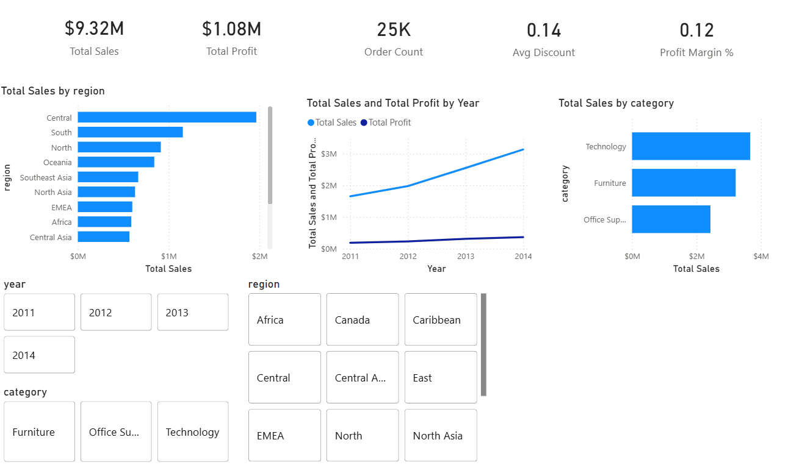

# Superstore Dashboard (Power BI Project)

## Objective
Create an interactive dashboard to visualize sales, profit, and category trends using the Superstore dataset.

## Business Questions
- Which categories are the most profitable?
- How do sales and profit trends change over time?
- Which regions or segments perform the best?

## Data Cleaning
- Fixed numeric columns (Sales, Profit, Discount) and removed symbols
- Converted dates using locale to handle DD/MM/YYYY format
- Verified unique Order IDs and no missing crictical data
- Created optional Profit Margin column

## Analysis
- Built KPIs for Total Sales, Total Profit, Avg Discount, Order Count, and Avg Discount Percent
- Created line charts to show sales and profit trends by year
- Analyzed category and subcategory performance
- Added filters/slicers for Year, Region, and Category

## Key Insights
- Technology and Furniture categories produced the highest revenue
- West and Central regions are top performers
- Profit margins vary significantly by category and segment

## Tools Used
- Power BI Desktop

## Files in This Project
- 'Superstore_Dashboard.pbix'
- Dashboard screenshots ('images/')
